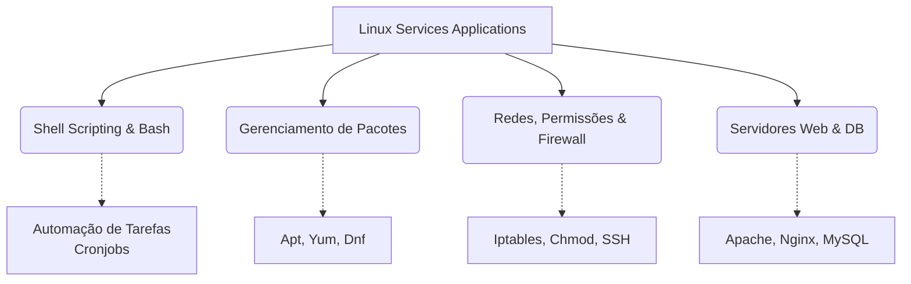

<div align="center">
  
  
  # Linux Services Applications 🐧

  **1º Semestre de 2026 | FIAP**

   
  
  
  

  *Repositório dedicado aos estudos, materiais e práticas da disciplina conduzida pelo **Prof. Guilherme Rodrigues (GuiTüx)**.*
</div>

---

## 📌 Sobre a Disciplina

A disciplina foca na administração, configuração e deploy de aplicações e serviços em ambientes **Linux**. Durante as aulas, transformamos teoria em prática dominando o sistema operacional mais utilizado em servidores ao redor do mundo.

> _"Apenas a prática consolida o conhecimento."_ — **Prof. Guilherme Rodrigues (GuiTüx)**

## 📚 Materiais do Curso

Para facilitar o processo de publicação e atualizar de forma simultânea, todos os materiais essenciais do curso estão organizados e centralizados num formato de fácil acesso via Google Drive oficial da disciplina:

- 🗂️ **Slides das Aulas:** Apresentações completas do semestre.
- 📝 **Atividades:** Exercícios contínuos baseados na prática.
- 🎟️ **Vouchers:** Links exclusivos disponibilizados para a turma.

🔗 **[Acessar o Drive da Disciplina (Materiais e Vouchers)](https://bit.ly/fiap-1)**

## 🛠️ Tecnologias e Conceitos



## 📁 Estrutura do Repositório

```bash
📂 LINUX_SERVICES_APPLICATIONS_1SM_2026
 ┣ 📂 aulas/                      # Anotações e materiais das semanas
 ┃ ┗ 📜 FIAP - Linux - Materiais da Disciplina.pdf
 ┣ 📜 .gitignore                  # Arquivos ignorados pelo Git
 ┣ 📜 LICENSE                     # Licença do projeto
 ┗ 📜 README.md                   # Documentação (você está aqui!)
```

## 🚀 Como começar?

Para clonar e acompanhar este repositório nos seus estudos locais, basta usar o terminal:

```bash
# Clone este repositório
$ git clone https://github.com/carmipa/LINUX_SERVICES_APPLICATIONS_1SM_2026.git

# Acesse o diretório do projeto
$ cd LINUX_SERVICES_APPLICATIONS_1SM_2026

# Pronto, comece seus estudos e pratique muito no terminal Linux!
```

---

<div align="center">
  <sub>Criado e mantido com 💻 e muita prática! | Ano: 2026</sub>
</div>
